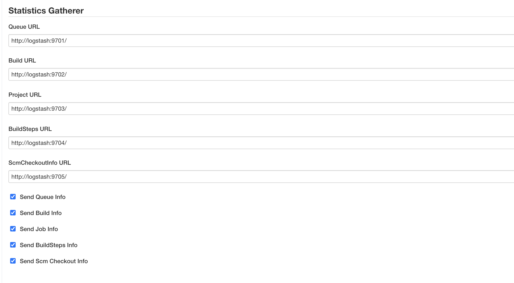

# jenkins monitoring
A poc validating jenkins monitoring based on statistics-gatherer plugin (https://plugins.jenkins.io/statistics-gatherer/) and ELK stack.

# Summary of set up
+ Install Docker
+ Activate Jenkins
+ Install statistics-gatherer plugin
+ Congigure logstash http endpoints in statistics-gatherer plugin
+ Launch jenkins sample jobs
+ Get jenkins build, queues and projects data in elastcsearch

# Detailed setup 
+ Install docker
+ create directories elasticsearch-data and jenkins_data under 'docker' directory
+ docker-compose up
+ check jenkins logs, get admin unlocking key, go to jenkins on http://localhost:8083/ and unlock using this key
+ create an admin account
+ create a Helloworld job
+ Install statistics-gatherer last version: download last release (2.0.3) on https://plugins.jenkins.io/statistics-gatherer/#releases and install the hpi file using jenkins console
+ configure the plugin using the logasth http inputs as configured in [logstash pipelines](docker/logstash/pipeline) : 
